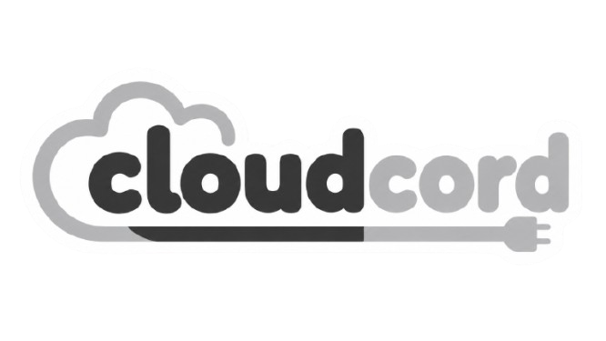

<p align="center">
  
</p>

<h1 align="center">CloudCord</h1>

<p align="center">
  A Discord iOS mod built from a RainTweak-style native loader and a CloudCord-based runtime.
</p>

<p align="center">
  <a href="https://github.com/BypassHub-EX/cloudcord/actions/workflows/cloudcord.yml">
    
  </a>
  <a href="runtime/LICENSE">
    
  </a>
  
  
</p>

<p align="center">
  
</p>

## What this is

CloudCord bundles the pieces needed to build and test a branded Discord iOS mod:

- `native-ios/` - Theos tweak and native loader files
- `runtime/` - JavaScript runtime, settings UI, patches, plugin loader, and build scripts
- `cloudcord-official-plugins/` - bundled plugin source and manifests
- `dist/` - checked-in runtime bundles
- `assets/` - CloudCord icons and branding assets
- `manifests/` - CloudCord manifest files
- `docs/` - extra notes, credits, and iOS build details

It is source code, not a prebuilt IPA.

## Included plugins

The official plugin pack currently includes:

- FakeProfile
- NoTrack
- MessageFix
- QuickInstall
- CloudCord Enhancements
- Badges

Plugin sources live in `cloudcord-official-plugins/builds/`.

## Build runtime

```sh
cd runtime
bun install
bun run build
```

For local testing, serve the runtime bundle:

```sh
cd runtime
bun run serve
```

Then enable the custom runtime URL in the app's developer settings and point it at the served bundle.

## Build iOS tweak

```sh
cd native-ios
make package
```

You need a working Theos setup and your own signing/sideloading flow. See `docs/BUILD-iOS.md` for the rough end-to-end build notes.

<details>
<summary>iOS sideloading notes</summary>

Some Discord features depend on entitlements and bundle identifiers that a sideloaded app may not have. If something behaves differently from the App Store build, check your signing profile, bundle ID, and entitlements first.

</details>

## Credits

CloudCord is based on work from the RainTweak and CloudCord projects, with CloudCord-specific branding, assets, packaging, and plugin sources layered on top.

See `docs/CREDITS.md` and `credits/CREDITS.md` for attribution.
